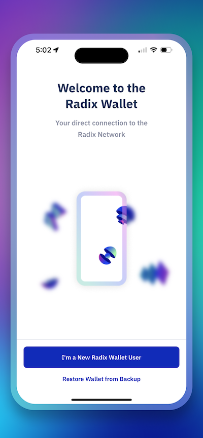
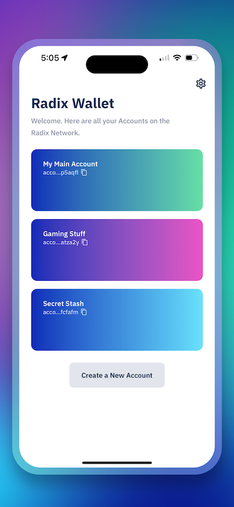
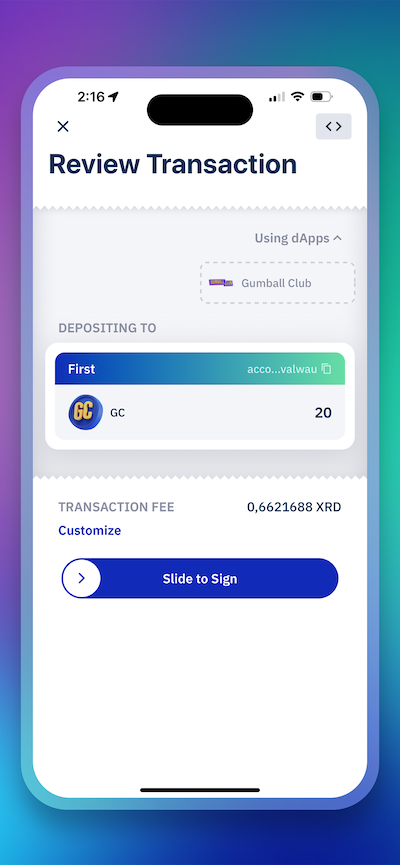
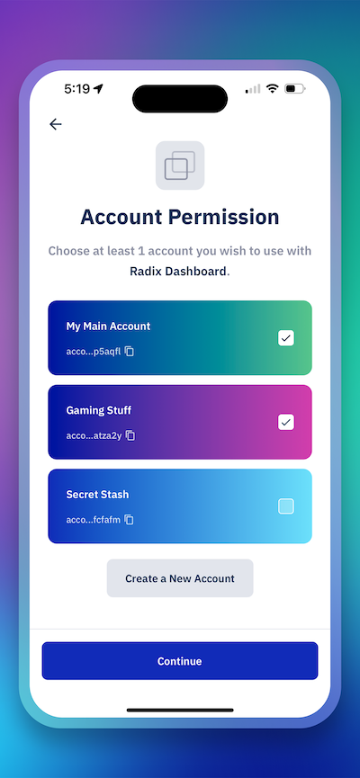

# Radix Wallet

The Radix Wallet is your direct connection to the [Radix Network][dashboard], a decentralized platform designed specifically for great Web3 and DeFi dApps. Your Radix assets and identity are all held and managed in one convenient place, designed to connect seamlessly to Radix dApps.

The Radix Wallet can be downloaded from [the App Store][appStoreLink] (requires iOS 16.4).

[][appStoreLink]

### Screenshots

  
   
   
   

# Introduction
Create and manage Accounts that hold any type of asset on Radix (including the platform's native `XRD` token) displayed beautifully so you understand what you own at a glance. Create Personas to easily login to Radix dApps with one click. The Radix Wallet always makes sure that you're in control, with easy-to-understand transactions and clear dApp permissions so there are no surprises.

The Radix Wallet takes advantage of the advanced native features of the Radix Network. That means totally decentralized, non-custodial access to what you own; you always have direct access without any company in the middle.

# Getting Started
Head over to [wallet.radixdlt.com for a guide][walletGuide] to download and get started with wallet.

# Contribute
To get started contributing to the Radix Wallet iOS code base [head over to the development guide](./DEVELOPMENT.md)

# License
The code for the iOS Radix Wallet is released under the [Apache 2.0 license](./LICENSE). Binaries are licensed under the [Radix Wallet Software EULA](https://www.radixdlt.com/terms/walletEULA).

[dashboard]: https://dashboard.radixdlt.com
[radixdlt]: https://radixdlt.com
[appStoreLink]: https://apps.apple.com/se/app/radix-wallet/id6448950995
[walletGuide]: https://wallet.radixdlt.com